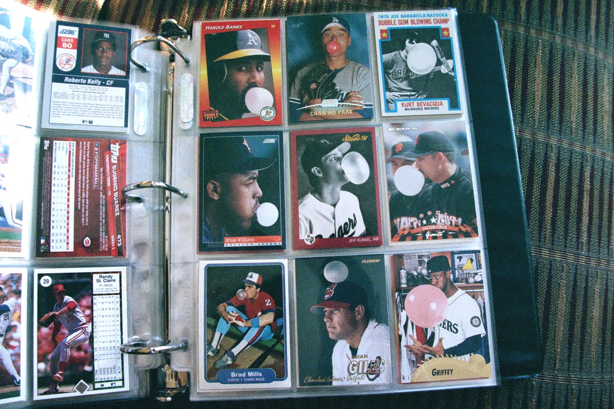

# Bubble Gum Cards API
 > A curated set of the world's best baseball cards

The Bubble Gum Cards API provides access to a curated set of baseball cards. The collection is unique in that the individual cards have been categorized by the contents of their photograph. Individually, the cards have little value by themselves but when grouped together, they become priceless. New cards are added periodically.

A basic app using this API can be found at [https://bubblegumcards-1-m1415162.deta.app](https://bubblegumcards-1-m1415162.deta.app).

The inspiration for this project is found in the blog post [How To Collect Baseball Cards](https://johnboucha.com/writing/how-to-collect-baseball-cards/).



## Getting started

Let's make your first request to the Bubble Gum Cards API.

Open up Terminal, Postman, or another tool to make a request for a resource. In the example below, a request is made to the baseball card with an ID equal to 1.

```
https://bgcardsapi-1-u6196911.deta.app/api/cards/1
```

Here is the response.

```HTTP/1.0 200 OK
Content-Type: application/json
{
	"id": 1,
	"year": 1989,
	"manufacturer": "Fleer",
	"player": "Billy Ripken",
	"series": "",
	"number": "616",
	"description": "Player is holding a bat with the words Fuck Face written on the end of the handle.",
	"category": "Priceless",
	"parallel": "",
	"image": "1989-fleer-ripken.jpg"
}
```

## Base URL

The Base URL is the root URL that all requests will begin. The documentation assumes you are appending all endpoints to the Base URL to make requests.

```
https://bgcardsapi-1-u6196911.deta.app/api/
```

## Authentication

The Bubble Gum Cards API is free and open. No authentication is required to query data using GET requests. Other HTTP method requests are not available.

## Query String Options

The API includes ```skip``` and ```top``` options when querying a resource. Skip excludes the first _N_ items of a resource and top limits the response to _N_ items. The default value of ```skip``` is 0. The default value of ```top``` is 9.

As an example, the following request will return 5 cards starting from the 10th card.

```
https://bgcardsapi-1-u6196911.deta.app/api/cards/?skip=9&top=5
```

## Search

All resources support a search parameter that filters the results returned. Searches are not case sensitive and partial matches on field contents are returned.

An example of a search query is shown below.

```
https://bgcardsapi-1-u6196911.deta.app/api/cards/?search=steve
```

## Resources

### Root

The Root resource path returns available resources within the API.

Example request:

```
https://bgcardsapi-1-u6196911.deta.app/api/
```

Example response:

```
HTTP/1.0 200 OK
Content-Type: application/json
{
	"cards": "/api/cards/",
	"manufacturers": "/api/manufacturers/",
	"players": "/api/players/",
	"teams": "/api/teams/",
	"categories": "/api/categories/"
}
```

Resources:

- ```cards``` The root URL for Cards resources
- ```manufacturers``` The root URL for Manufacturers resources
- ```players``` The root URL for Players resources
- ```teams``` The root URL for Teams resources
- ```categories``` The root URL for Categories resources

## Cards

A Card resource is an individual card within the collection.

Endpoints

- ```/cards/``` gets all the card resources
- ```/cards/:id/``` gets specific card by its ID

Example request:

```
https://bgcardsapi-1-u6196911.deta.app/api/cards/2
```

Example response:

```
HTTP/1.0 200 OK
Content-Type: application/json
{
	"id": 2,
	"year": 1989,
	"manufacturer": "ProCards",
	"player": "Kieth Comstock",
	"series": "Minor League Team Sets",
	"number": "14",
	"description": "A baseball is impacting the player's crotch",
	"category": "Priceless",
	"parallel": "",
	"image": "1989-procards-comstock.jpg"
}
```

Attributes:

- ```year``` the year the card was produced
- ```manufacturer``` the company who manufactured the card
- ```player``` the baseball player or athlete
- ```series``` specified if card is a member of a non-regular set
- ```number``` the card number
- ```description``` a description of the card's photograph
- ```category``` the category the card belongs to in the collection
- ```parallel``` specified if card is a parallel version
- ```image``` name of the reference image on the server

Searchable fields:

- ```player```
- ```description```

Query parameters:

- ```category```

An example query using the category parameter is shown below:

```
https://bgcardsapi-1-u6196911.deta.app/api/cards/?category=telephone
```

Example response:

```
HTTP/1.0 200 OK
Content-Type: application/json
[{
	"id": 28,
	"year": 1994,
	"manufacturer": "Upper Deck",
	"player": "Cal Ripken Jr",
	"series": "Collector's Choice",
	"number": "240",
	"description": "",
	"category": "Telephone",
	"parallel": "",
	"image": ""
},
{
	"id": 29,
	"year": 1996,
	"manufacturer": "Stadium Club",
	"player": "Todd Zeile",
	"series": "",
	"number": "420",
	"description": "",
	"category": "Telephone",
	"parallel": "",
	"image": ""
},
...]
```
